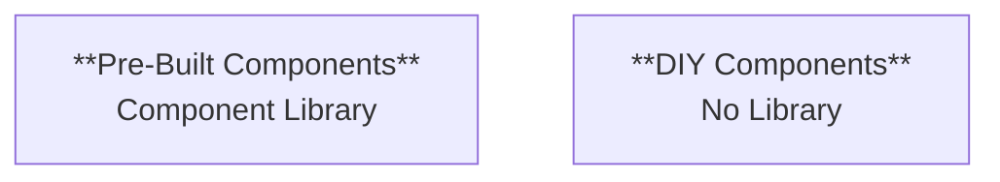
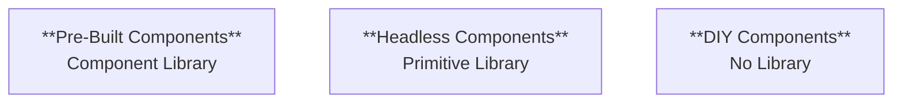
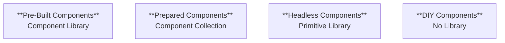
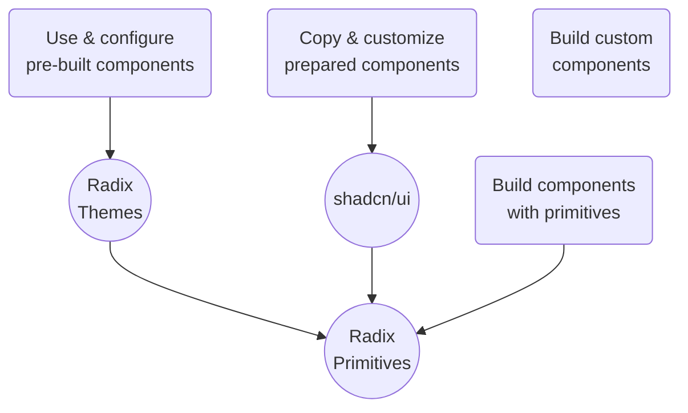

---
# You can also start simply with 'default'
theme: default
# random image from a curated Unsplash collection by Anthony
# like them? see https://unsplash.com/collections/94734566/slidev
background: images/library-at-trinity-college-1527437166Ojx.jpg
# some information about your slides (markdown enabled)
title: Headless Components
info: |
  ## Slidev Starter Template
  Presentation slides for developers.

  Learn more at [Sli.dev](https://sli.dev)
author: Mathis Hofer, Puzzle ITC
# apply unocss classes to the current slide
class: text-center
# https://sli.dev/features/drawing
drawings:
  persist: false
# slide transition: https://sli.dev/guide/animations.html#slide-transitions
transition: slide-left
# enable MDC Syntax: https://sli.dev/features/mdc
mdc: true
hideInToc: true
---

# Headless Components

Tech Kafi 15.01.2025

Mathis Hofer \
Puzzle ITC

---
layout: center
transition: slide-left
hideInToc: true
---

# Agenda

<Toc text-sm minDepth="1" maxDepth="1" />

---
layout: image-right
image: images/vintage_headless_man_by_hauntingvisionsstock_d2ti3fz-375w-2x.jpg
class: centered
transition: slide-up
---

# Introduction

---
layout: center
class: text-center
transition: slide-up
level: 2
---

# Headless Component

The design pattern™

Separation of rendering & UI \
from behavior & state management

Headless Component = Component Primitive

Bring your own styles

---
layout: quote
transition: slide-up
level: 2
---

«In essence, a Headless Component is a function or object that encapsulates logic, but doesn’t render anything itself. It leaves the rendering part to the consumer, thus offering a high degree of flexibility in how the UI is rendered.»

– Juntao QIU, martinfowler.com

---
transition: slide-up
level: 2
---

# Headless Component

How to extract that logic & state?

React:
- hooks
- render props
- low-level components
- context
- HOCs

Angular:
- directives
- services
- (ng-templates)

---
transition: slide-up
level: 2
---

# React Dropdown

```ts
// The "headless component" or component primitive
function useDropdown() {
  // ...all the dropdown logic/state
  return {
    // ...exposed logic/state
  };
}

// Our component implementation using the "headless component"
function Dropdown({ items }: DropdownProps) {
  const {
    isOpen,
    selectedItem,
    selectedIndex,
    toggleDropdown,
    handleKeyDown,
    setSelectedItem,
  } = useDropdown(items);

  return (
    // ...render & style the UI using the available logic/state
  );
}
```

---
transition: slide-left
level: 2
---

# Why Headless Components?

- Reusability & DRY
- Maintainability & testing
- Versatility & customizability

<div class="text-center mt-10">
→ Inversion of control:
Put (UI) power in the developer's hands
</div>

---
layout: image-right
image: images/library-at-trinity-college-1527435025tIj.jpg
class: centered
transition: slide-up
---

# On Libraries and Craft

---
transition: undefined
level: 2
---

# Approaches

Should I use existing components or craft them by hand?



---
transition: slide-up
level: 2
---

# Approaches

Neither the one nor the other!



---
layout: image-right
image: images/bootstrap-meme.jpg
transition: slide-up
level: 2
---

# Approaches: Pre-Built Components

Component Libraries

- Ready-made components – install and go 🚀
- "Customization" via configuration, theming & component attributes/props
  - Little control
  - Hard to implement customer's CI/CD
  - Every site/app looks the same... 🤷‍♂
- Huge/complex dependency, may even block framework upgrade

---
transition: slide-up
level: 2
---

# Approaches: Pre-Built Components (cont.)

Component Libraries

Examples:
- [Bootstrap](https://getbootstrap.com/)
- [Angular Material](https://material.angular.io/), [Material UI](https://mui.com/)
- [Adobe Spectrum](https://spectrum.adobe.com/) (React, WC)
- [Radix Themes](https://www.radix-ui.com/) (React)
- ...

---
transition: slide-up
level: 2
---

# Approaches: DIY Components

No Component Library

- Craft your own components/design system from the ground up
  - Full control
  - Complex & laborious 😫
- A11y/ARIA, keyboard control, responsiveness, async data loading, feature set → 🤯
  - Even hard for simple dropdown, what about a datepicker?
- No dependency
- Examples: \
  [Tailwind](https://tailwindcss.com/), Vanilla CSS

---
layout: image
image: images/headless-meme.jpg
backgroundSize: contain
---

---
transition: slide-up
level: 2
---

# Approaches: Headless Components

Primitive Library

- Build your own components using existing primitives
- Customization via custom rendering & styling
  - Full control over UI/look
  - Easily implement customer's CI/CD & UX requirements
- Simple dependency (only install required primitives)

---
transition: slide-up
level: 2
---

# Approaches: Headless Components (cont.)

Primitive Library

Examples:

- [Radix Primitives](https://www.radix-ui.com/primitives) (React) → Adobe Spectrum builds on this
- [React ARIA](https://react-spectrum.adobe.com/react-aria/) (React)
- [Headless UI](https://headlessui.com/) (React, Vue)
- [Kobalte](https://kobalte.dev/) (SolidJS)
- [Melt UI](https://www.melt-ui.com/) (Svelte)
- [Angular CDK](https://material.angular.io/cdk/) → Angular Material builds on this
- [Angular Primitives](https://angularprimitives.com/)
- [Ark UI](https://ark-ui.com/) (React, Solid, Vue, Svelte)
- ...

---
layout: center
class: text-center
transition: slide-up
level: 2
---

# But wait...

---
transition: slide-left
level: 2
---

# ...there is one more approach!



---
layout: iframe-right
url: https://ui.shadcn.com/docs
class: centered
transition: slide-up
---

# shadcn/ui

---
transition: slide-left
level: 2
---

# ...

---
layout: image-right
image: images/The_Headless_Horseman.jpg
class: centered
transition: slide-up
---

# Conclusion

---
transition: slide-up
level: 2
---

# Recap

The (component) world is full of possibilities



---
layout: quote
transition: slide-up
level: 2
---

Headless components might be what you want.

---
transition: slide-up
level: 2
---

# Further Resources

- [Headless Component: a pattern for composing React UIs](https://martinfowler.com/articles/headless-component.html) (martinfowler.com)
- [ARIA Authoring Practices Guide (APG) – Patterns](https://www.w3.org/WAI/ARIA/apg/patterns/) (WAI)
- [How headless components became the future for building UI libraries](https://www.subframe.com/blog/how-headless-components-became-the-future-for-building-ui-libraries) (subframe.com)
- [Headless Angular Components](https://angular.love/headless-angular-components) (angular.love)

---
transition: slide-up
level: 2
---

# Questions? Discussion?

These slides are licensed under the terms of the [CC BY 4.0](https://creativecommons.org/licenses/by/4.0/) license.

Images:

- [Library at Trinity College](https://www.publicdomainpictures.net/en/view-image.php?image=255075&picture=library-at-trinity-college) CC0
- [Vintage Headless Man](https://www.deviantart.com/hauntingvisionsstock/art/Vintage-Headless-Man-170485487) CC BY 3.0
- [Bibliotecă la Colegiul Trinity](https://www.publicdomainpictures.net/ro/view-image.php?image=255067&picture=bibliotec-la-colegiul-trinity) CC0
- [Capt. Mayne Reid’s version of a Texas Legend](https://en.wikipedia.org/wiki/The_Headless_Horseman_(novel)#/media/File:The_Headless_Horseman.jpg) CC0

<PoweredBySlidev mt-10 />
